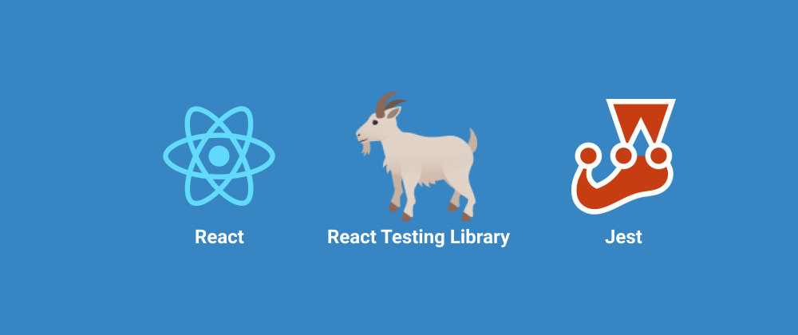

# **RTL(React Testing Library)를 활용한 Axios Mockup 테스트**



실습의 전반적인 내용은 아래 링크의 페이지에 자세하게 설명이 되어있다. <br/>
[https://testing-library.com/docs/react-testing-library/example-intro/](https://testing-library.com/docs/react-testing-library/example-intro/)

### <ins>**React Testing Library 설치**</ins>

```bash
$ npm install --save-dev @testing-library/react
```

<br/>

### (1) <ins>**react-testing-library에서 지원하는 render()function을 이용해서 테스트하고자 하는 component의 rendering 테스트하기**</ins>

```javascript
import { render } from "@testing-library/react";
import Fetch from "./Fetch";
....
const { getByTestId } = render(<Fetch url={url} />);
```

<br/>

### (2) <ins>**rendering한 component의 요소에 `data-testid`를 지정해서 해당요소를 검사할 수 있다. **</ins>

```javascript
import "@testing-library/jest-dom/extend-expect";

it("fetches and displays data", async () => {
  const url = "/greeting";
  // Fetch component를 rendering하게 되면 rendering된 객체를 확인할 수 있다.
  // rendering된 객체 중에 속성으로 data-testid로 id를 지정해준 부분을 체크할 수 있다.
  const { getByTestId } = render(<Fetch url={url} />);
  expect(getByTestId("loading")).toHaveTextContent("Loading data...");
});
```

<br/>

### (3) <ins>**각 테스트 단계가 끝나면 테스트 상태를 초기화 시키기 위해서 `afterEach(cleanup)`를 사용한다. (cleanup은 react-testing-library에서 지원한다)**</ins>

```javascript
afterEach(cleanup);
```

### (4) <ins>**component에 전달할 props를 직접 작성한 뒤에 주입해서 테스트할 수 있다.**</ins>

```javascript
it("fetches and displays data", async () => {
  // Fetch component에 전달할 url props
  const url = "/greeting";
  const { getByTestId } = render(<Fetch url={url} />);
  expect(getByTestId("loading")).toHaveTextContent("Loading data...");
});
```

<br/>

### (5) <ins><b>Axios를 통한 데이터 처리를 테스트할때 실제 HTTP를 통한 데이터 취득은 이루어지지 않는다. 그 이유는 실제 서버로부터 데이터를 취득하면 시간도 상대적으로 오래 걸리는 경우도 있기 때문이다.</b></ins>

**따라서 Axios를 통한 데이터 취득을 할때, 실제 서버로부터 취득하는 데이터를 mockup해서 테스트를 진행한다.**

- Step1) src 폴더 아래에 **mocks** 폴더를 만들고, axios module의 mockup을 위해 `axios.js`파일을 생성한다.

**axios.js**

```javascript
export default {
  // axios get() mockup function
  get: jest.fn().mockResolvedValue({ data: {} })
};
```

이렇게 **mocks** 폴더 내부에서 mockup axios 파일을 만들어주면, 테스트 파일내에서 axios module을 호출할때, 실제 axios module이 아닌, `__mocks__` 폴더내에서 mockup한 axios module을 호출하게 된다.

<br/>

테스트 파일에서 이 mockup한 axios module을 override해서 값을 새롭게 정의한 다음에 새롭게 customize된 값을 가진 axios module을 이용해서 테스트를 진행할 수 있다.

```javascript
axiosMock.get.mockResolvedValueOnce({ data: { greeting: "hello world" } });
```

### (6) 비동기 처리부분을 테스트하는 경우, 해당 부분이 화면에 rendering되는 것을 기다려줘야 한다. (`waitForElement()`은 deprecated되었기 때문에 `waitFor()`로 대체 사용한다)

```javascript
// 실제 데이터가 넘어갔을때 화면에 보여지는 tag 부분에 "resolved" id를 삽입하였다.
const resolvedSpan = await waitFor(() => getByTestId("resolved"));

// 이제 mockup으로 넣어준 데이터가 테스트 component의 span tag에 제대로 출력이 되는지 요소검사를 한다.
expect(resolvedSpan).toHaveTextContent("hello world");
```

<br/>

### (7) <ins><b>mockup axios function이 제대로 호출되고 있는지 확인한다.</b></ins>

```javascript
// axiosMock.get mockup function이 한 번 호출되었는지 체크
expect(axiosMock.get).toHaveBeenCalledTimes(1);
// axiosMock.get이 호출될때 같이 넘겨준 argument를 체크
// axios.get() function의 argument로 지정 url을 넘겨주었는지 체크
expect(axiosMock.get).toHaveBeenCalledWith(url);
```
